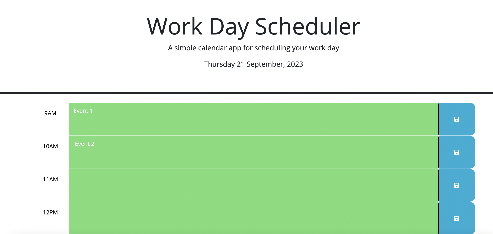
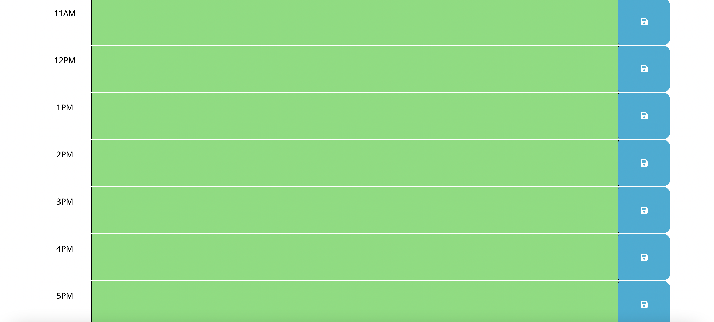

# Calendar Schedule Application 📅

## Description
The purpose of this project is to create a calendar schedule application which allows a user to organise their workday based on their daily events.

## Requirements
- Ensure current day displayed on top of page
- Ensure timeblocks presented for standard business hours 9am - 5pm
- Ensure colour-coding of timeblocks to indicate whether event is in past, present or future
- Ensure ability to enter each event
- Ensure text saved to local storage upon click of save button icon
- Ensure saved event persists upon refreshing page

## Webpage Preview

## Link to Deployed Application
[Deployed Webpage](https://ajaycshan.github.io/password-generator/)